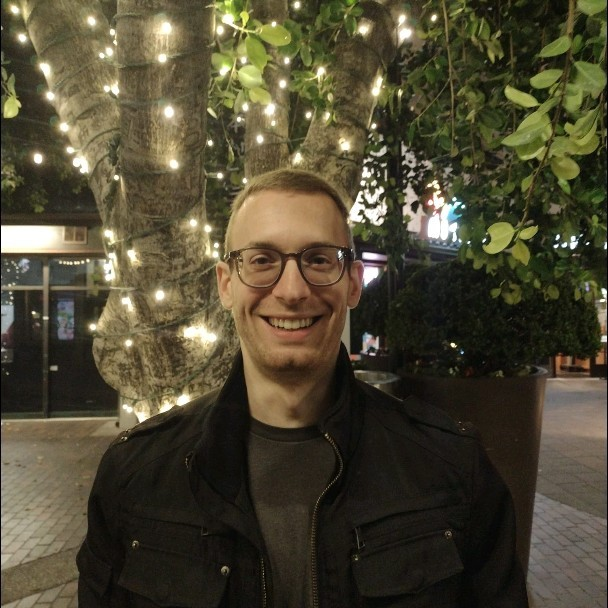

---
# Feel free to add content and custom Front Matter to this file.
# To modify the layout, see https://jekyllrb.com/docs/themes/#overriding-theme-defaults

layout: page
---

{: width="200" }

I am an Offensive Security Engineer at NVIDIA, working on the [DriveOS platform](https://developer.nvidia.com/drive/os) within the automotive org. My work focuses on automating security workflows and supporting offensive security efforts, with a particular interest in leveraging LLMs to scale and augment security analysis.

More broadly, I am interested in systems security and in understanding the layers of computation that lie beneath immediate interfaces—spanning low-level components such as hypervisors, operating systems, and firmware. During my research at [Univeristy of California, Santa Barbara](https://www.ucsb.edu/) under the supervision of [Giovannia Vigna](https://sites.cs.ucsb.edu/~vigna/) and [Christopher Kruegel](https://sites.cs.ucsb.edu/~chris/), I worked on operating system security, with a focus on kernel fuzzing. My broader interests include binary analysis, root cause analysis, ML applications in security, as well as ARM TrustZone, rehosting, and OS security.

If you are interested in related topics, feel free to reach out—I am always happy to connect.

## Education
**University of California, Santa Barbara** \
PhD program in Computer Science, exited with Masters

**Friedrich-Alexander University Erlangen-Nuremberg** \
Bachelor of Science in Computer Science, *graduated with distinction*

## Publications

**ACTOR: Action-Guided Kernel Fuzzing** (USENIX '23) <small> [pdf](docs/pubs/sec23_actor.pdf) [cite](docs/bibs/sec23_actor.bib) </small> \
Marius Fleischer, Dipanjan Das, Priyanka Bose, Weiheng Bai, Kangjie Lu, Mathias Payer, Christopher Kruegel, Giovanni Vigna

**Syzgrapher: Resource-Centric Graph-Based Kernel Fuzzing** (RAID '25) <small> [pdf](docs/pubs/raid25_syzgrapher.pdf) [cite](docs/bibs/raid25_syzgrapher.bib) </small> \
Marius Fleischer, Harrison Green, Ilya Grishchenko, Christopher Kruegel, Giovanni Vigna

**Orion: Fuzzing Workflow Automation** (Arxiv '25) <small> [pdf](docs/pubs/arxiv25_orion.pdf) [cite](docs/bibs/arxiv25_orion.bib) </small> \
Max Bazalii, Marius Fleischer

[Google Scholar](https://scholar.google.com/citations?hl=en&user=xU4DqLsAAAAJ)

## Projects

Speech Style Transfer <small>Fall 2022</small>
* Developed one-click pipeline for speech style transfer based on SOTA models AutoPST, AutoVC
* Evaluated the model performance on a multi-accent name dataset, live data during a demo presentation

Fake News Detection <small>Spring 2022</small>
* Developed an end-to-end data collection pipeline using the Twitter API v1 and v2 that generates a dataset for Graph Neural Network (GNN) models starting from a set of root tweets
* Evaluated the performance of existing GNN models (developed in PyTorch) on multiple social media datasets
